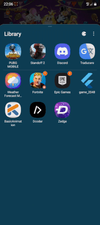

# Weather-Forecast-Android-App

Weather Forecast Mobile App for Android implemented via Koltin dedicated packages:
- Gson
- Retrofit
- Kodein
- Room
- Kotlinx Coroutines
- Lifecycle Livedata and ViewModel
- Gms location provider
- ConstraintLayout
- Material Theme
- Glide

## TODO List
- [ ] fix **Unit System/Location is not updated in current session from shared preferences** bug
- [ ] add future forecast for 3 days hourly
  - [x] room infrastructure
  - [ ] view model
    - [x] list days
    - [ ] list hours
    - [x] detail day
    - [ ] detail hour
  - [ ] ui (fragment + layouts)
    - [x] list days
    - [ ] list hours
    - [x] detail day
    - [ ] detail hour
